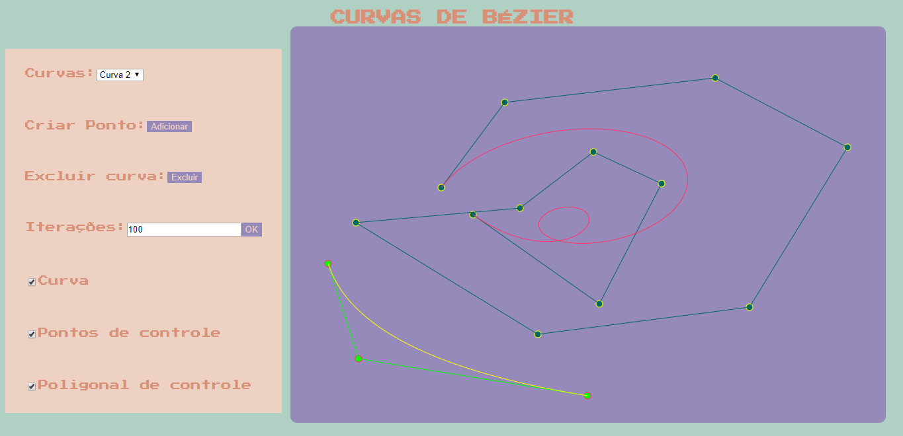

# Mini_Projeto_PG

O projeto: Curvas de Bézier Interativas
O usuário entra via mouse com os pontos de controle de curva(s) de Bézier,
podendo criar mais de uma curva, que podem ser modificadas independente da
ordem que foram construídas.

instruções:
	No projeto começa sem nenhuma curva, você terá que clicar no botão adicionar para adicionar uma curva.
	Para adicionar pontos de controle numa curva é só clicar na página na área do "canvas" com o botão esquerdo do mouse, e, para remover um ponto de controle é só clicar com o botão direito do mouse em cima do ponto desejado à remover, para mover um ponto de controle só apertar o botão esquerdo do mouse e mover o mouse na direção desejada, depois só soltar o botão.
	Caso queira apagar alguma curva, é só selecionar na caixa qual deseja apagar e clicar no botão "excluir"

